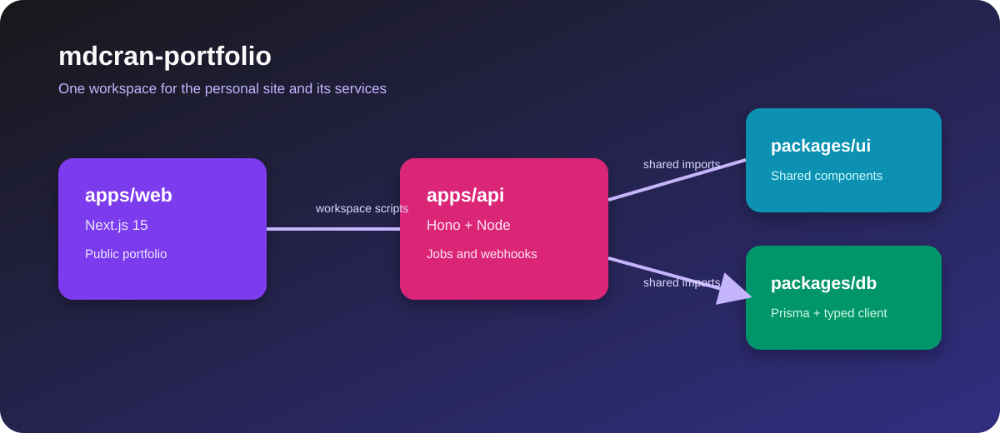
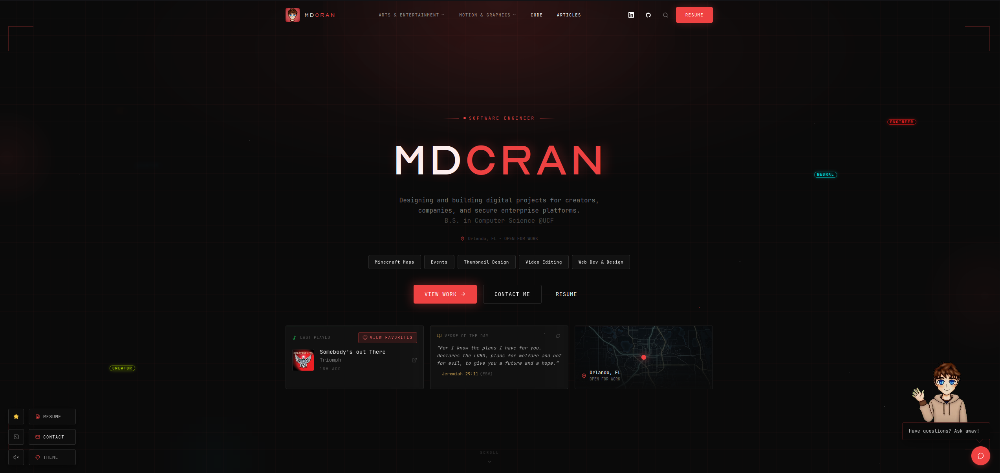
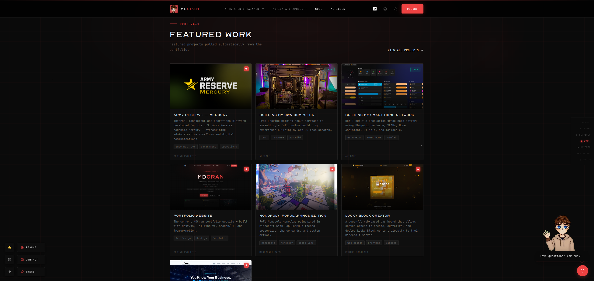
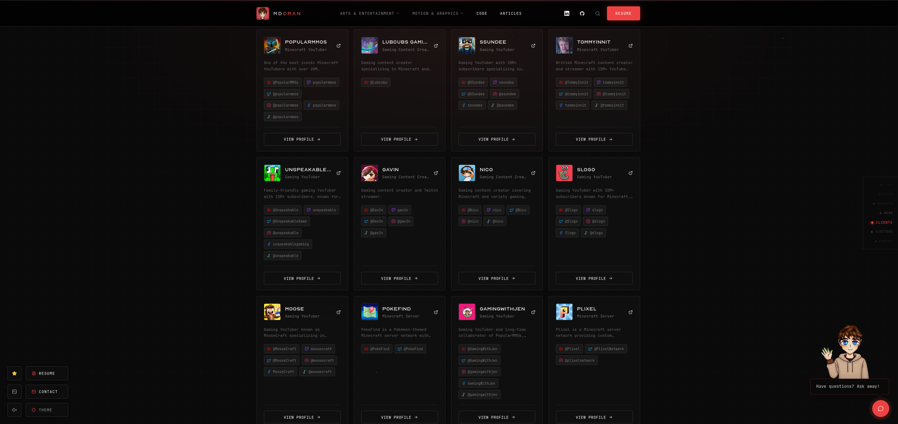
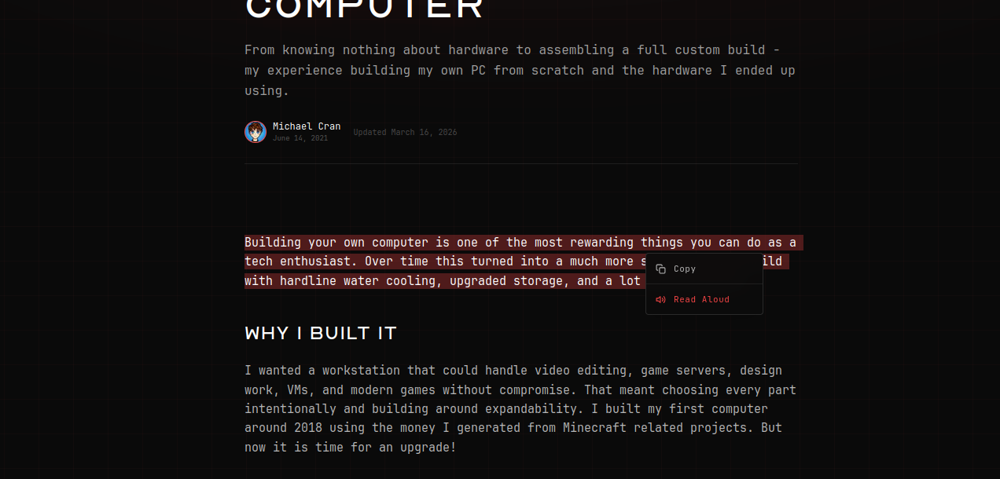
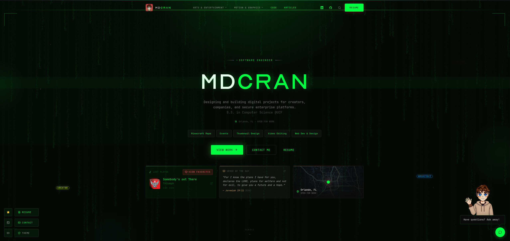

# mdcran-portfolio

 
Modern personal portfolio showcasing full-stack projects, enterprise-grade systems, and interactive web experiences. 

## App screenshots

These captures show the portfolio running across its main public experiences.

### Home

### Featured work

### Clients

### Article

### Theme variant

